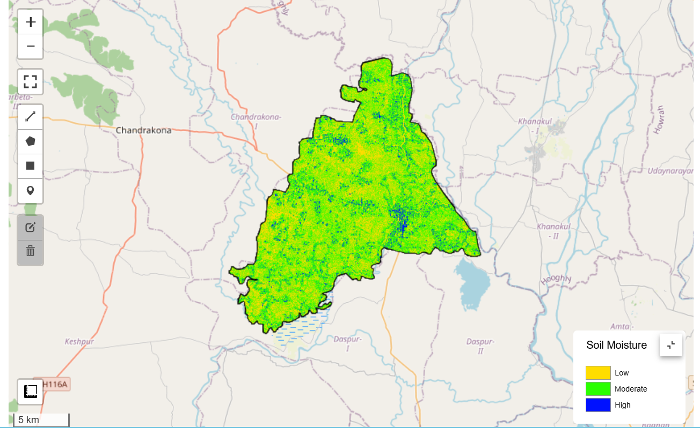
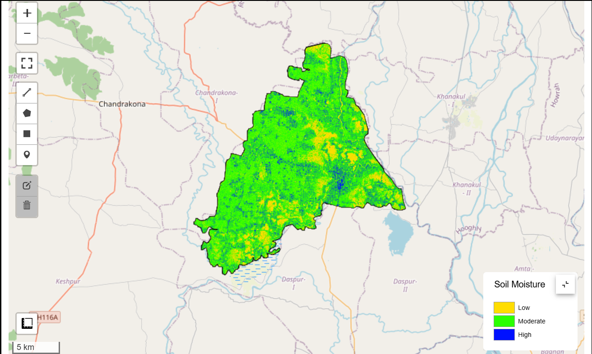
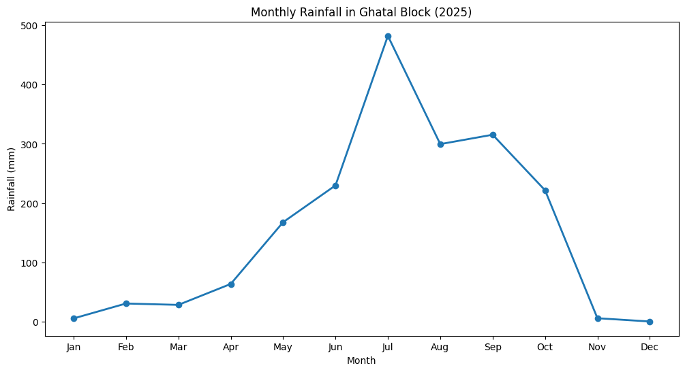

# 🌊 Flood Impact on Soil Moisture Using Sentinel-1 SAR in Ghatal Block, West Bengal

## 📌 Project Overview

This project analyzes the impact of the **July 2025 flood** on **surface soil moisture** in **Ghatal Block, Paschim Medinipur, West Bengal, India** using **Sentinel-1 SAR** satellite imagery.

The study compares **pre-flood** and **post-flood** soil moisture conditions and evaluates rainfall patterns using **CHIRPS Daily Rainfall** data. The workflow was developed using **Google Earth Engine (Python API)** and **Python in VS Code**.

---

## 📍 Study Area

- **Location:** Ghatal Block
- **District:** Paschim Medinipur
- **State:** West Bengal
- **Country:** India

Ghatal is one of the flood-prone regions of West Bengal due to the overflow of the **Shilabati River** during the monsoon season.


---

# 🎯 Objectives

- Estimate pre-flood soil moisture
- Estimate post-flood soil moisture
- Analyze soil moisture changes caused by flooding
- Study monthly rainfall during 2025
- Generate maps for flood impact assessment

---

# 🛰️ Data Used

| Data | Source | Purpose | Resolution |
|------|--------|---------|-----------|
| Sentinel-1 SAR (VV) | Copernicus | Soil Moisture Mapping | 10 m |
| CHIRPS Daily Rainfall | UCSB CHG | Rainfall Analysis | ~5 km |
| Ghatal Block Shapefile | Administrative Boundary | Area of Interest | Vector |

---

# 🛠 Software & Libraries

- Python
- Google Earth Engine (Python API)
- geemap
- GeoPandas
- Pandas
- NumPy
- Matplotlib
- VS Code
- ArcGIS PRO

---

# 📊 Methodology

```
Study Area
      │
      ▼
Data Collection
      │
      ├── Sentinel-1 SAR
      └── CHIRPS Rainfall
      │
      ▼
Pre-processing
      │
      ├── Image Filtering
      ├── Clip to AOI
      └── Mean Composite
      │
      ▼
Relative Soil Moisture Mapping
      │
 ┌────┴────┐
 ▼         ▼
Pre      Post
Flood    Flood
      │
      ▼
Difference Map
      │
      ▼
Rainfall Analysis
      │
      ▼
Result & Conclusion
```

---

# 📈 Project Outputs

✅ Study Area Map

✅ Pre-Flood Soil Moisture Map

✅ Post-Flood Soil Moisture Map

✅ Soil Moisture Difference Map

✅ Monthly Rainfall Graph (2025)

✅ Final Project Report (PDF)

---

## 📂 Repository Structure

```text
Flood-Impact-on-Soil-Moisture/
│
├── 📁 Ghatal Shapefile/
│   ├── Ghatal.shp
│   ├── Ghatal.dbf
│   ├── Ghatal.prj
│   ├── Ghatal.shx
│   └── ...
│
├── 📄 Flood_Soil_moisture.ipynb
├── 📄 Rainfall_ghatal.ipynb
├── 🖼️ Location Map.jpg
├── 🖼️ Pre_Flood_SMI.png
├── 🖼️ Post_Flood_SMI.png
├── 🖼️ Difference_SMI.png
├── 🖼️ Rainfall_Graph.png
└── 📄 README.md
```

---

# 📌 Results

The analysis shows that:

- Soil moisture increased significantly after the July 2025 flood.
- Low-lying agricultural areas experienced the highest increase in moisture.
- Rainfall peaked during July 2025, corresponding to the flood event.
- Sentinel-1 SAR successfully monitored soil moisture under cloudy monsoon conditions.

---
##  🖼️ Pre Flood SMI Map   

        

---
##  🖼️ Post Flood SMI Map



---
##  📈 Rainfall Graph



# 👨‍💻 Author

**Debraj Kolya**

Remote Sensing & GIS Specialist

LinkedIn: https://www.linkedin.com/in/debraj-kolya-57181b174

